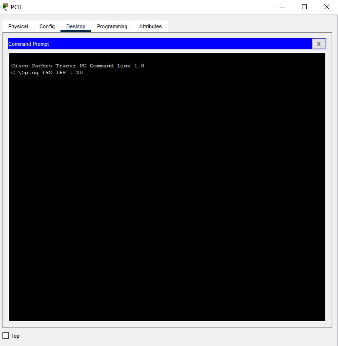
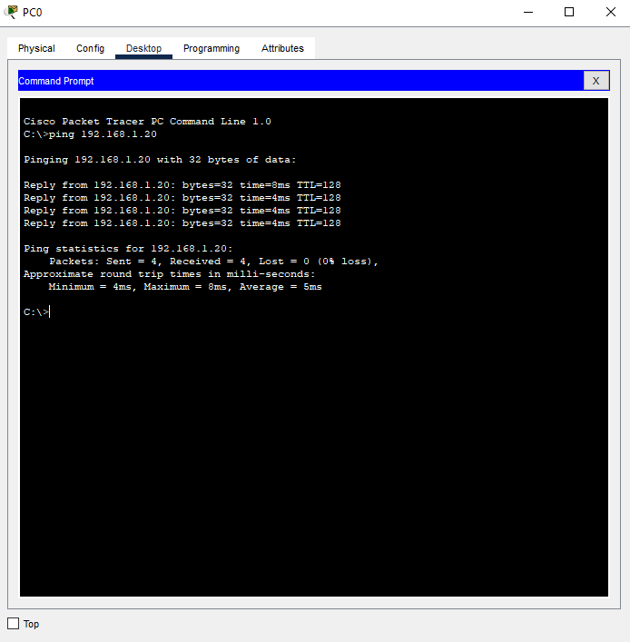
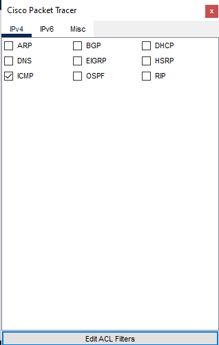
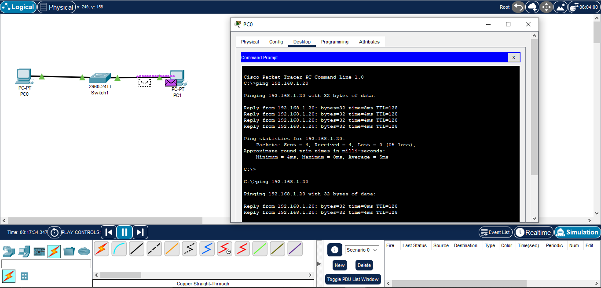
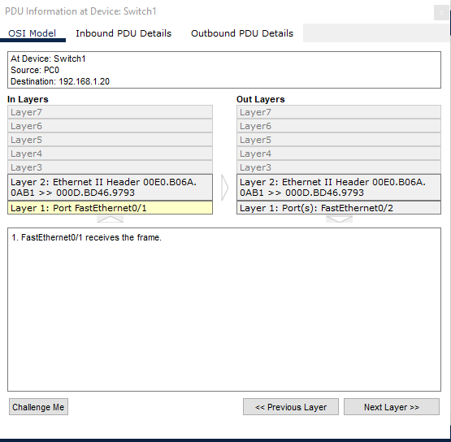
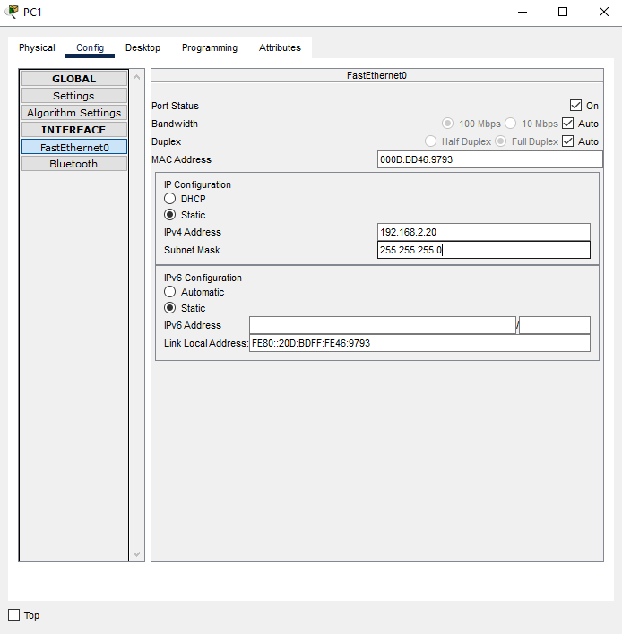
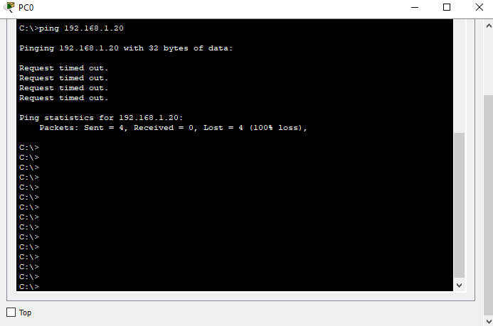
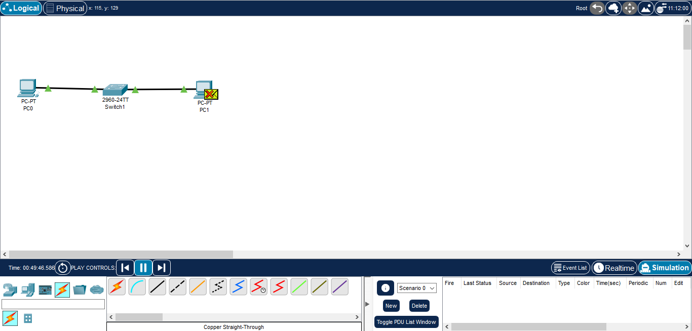

# 📘 CompTIA A+ Notes — Introduction to IP

This note explains **IP (Internet Protocol)** in simple terms, compares **TCP vs UDP**, shows how **ports and multiplexing** work, and includes a **basic Packet Tracer lab** with screenshots.

---

## 1. What is IP?

Think of IP like a **postal delivery system**:

- Every house has an **address** → Every device has an **IP address**.  
- The **roads** are the **network topology** (Ethernet, Wi-Fi, DSL, etc).  
- The **truck** is the **IP protocol** carrying the data.  
- The **boxes inside the truck** are the **data packets** being delivered.  

✅ IP’s job: move data from one IP address to another.

---

## 2. Encapsulation

When data is sent, it’s wrapped in layers (like nesting boxes):
- **Data** → the content you want to send.  
- **TCP/UDP** → Transport layer (decides reliability or speed).  
- **IP** → Network layer (addressing, delivery).  
- **Ethernet** → Data Link layer (local delivery by MAC address).  
- **Physical Medium** → Cables or Wi-Fi.  

---

## 3. TCP vs UDP (Transport Layer)

Both TCP and UDP ride **inside IP**. They are Layer 4 protocols.

### 🔹 TCP (Transmission Control Protocol)
- Connection-oriented (like a phone call).  
- Reliable → acknowledgements, retransmissions, ordering.  
- Flow control → receiver can manage speed.  
- **Examples:** HTTPS, SSH, FTP, SMTP.  

### 🔹 UDP (User Datagram Protocol)
- Connectionless (like a radio broadcast).  
- No guarantee of delivery → no ACK, no error recovery.  
- Faster, lightweight, used for real-time.  
- **Examples:** DNS, DHCP, VoIP, online gaming.  

---

## 4. Why UDP vs TCP?

- **UDP**: Good for speed and real-time (voice/video calls, DNS lookups).  
- **TCP**: Good for reliability (web traffic, banking, file transfers).  

---

## 5. Ports and Multiplexing

IP delivers packets to the **right device**.  
Ports deliver packets to the **right application** *on that device*.  

- **Well-known ports (non-ephemeral):**  
  - Port 80 → HTTP  
  - Port 443 → HTTPS  
  - Port 22 → SSH  
  - Port 53 → DNS  

- **Client ephemeral ports (temporary, assigned by OS):**  
  - Range: `1024–65535`  
  - Used to keep multiple connections active at once.  

### 🔹 Multiplexing
Multiplexing = one computer can use **many connections at the same time**:  
- Browser session on port 443  
- SSH session on port 22  
- DNS request on port 53  

---

## 6. Other Protocols Encapsulated in IP

Besides TCP and UDP, IP also carries:

- **ICMP** → diagnostics (e.g., `ping`).  
- **IGMP** → multicast streaming.  
- **ESP/AH (IPSec)** → VPN encryption.  

---

## 7. Protocol Examples

**UDP-based**
- DHCP → assigns IP addresses.  
- DNS → resolves names to IPs.  
- TFTP → lightweight file transfer.  

**TCP-based**
- HTTPS → secure web traffic.  
- SSH → secure remote login.  
- FTP → file transfer.  

---

# 🧪 Basic Lab Practical — Introduction to IP

We will test IP using **Cisco Packet Tracer**.

# 🧪 Introduction to IP — Basic Lab Practical

This lab demonstrates basic IP communication using Packet Tracer.  
We will configure two PCs on the same network, test connectivity, observe packets in simulation mode, and test a failure case.  

---

## Lab Objective
- Configure 2 PCs in the same subnet.  
- Test connectivity using `ping`.  
- Observe packets in Simulation Mode.  
- Show failure with wrong subnetting.  

---

## Lab Topology

## 🧪 Basic Lab Practical — Introduction to IP

### Lab Topology

PC0 (192.168.1.10) ---- Switch2960 ---- PC1 (192.168.1.20)

---

## Step 1 — Device Setup
- Add **PC0**, **PC1**, and a **2960 Switch** in Packet Tracer.  
- Connect the devices using **Copper Straight-Through cables**.  

📸 Result:  

---

## Step 2 — Assigning IP Addresses
- On **PC0**: set IP to `192.168.1.10` with subnet mask `255.255.255.0`.  
- On **PC1**: set IP to `192.168.1.20` with subnet mask `255.255.255.0`.  

📸 PC0 IP Config:  

📸 PC1 IP Config:  

---

## Step 3 — Testing Connectivity (Realtime Mode)
On **PC0**, open the Command Prompt and run:
ping 192.168.1.20

Result

---

---

🔹 Simulation Mode 

Switch to Simulation Mode to visualize packet movement.

1. Apply ICMP filter in Event List.

2. Run ping 192.168.1.20 from PC0.

3. Observe Echo Request and Echo Reply packets moving between devices.

Packet Detail

---

🔹 Broken Case (Wrong Subnet)

To see why correct addressing matters:

Change PC1 IP to 192.168.2.20 / 255.255.255.0

From PC0, run:

ping 192.168.2.20

Result: Packets leave PC0 but never return because PCs are in different subnets with no router in between.

(Ping Fail):

(Simulation Fail):

---

✅ Summary

IP addressing allows devices to communicate in the same subnet.

Ping Success confirms connectivity via ICMP Echo Request/Reply.

Simulation Mode reveals how packets travel inside the network.

Wrong Subnet Case shows why routers are needed between different networks.

This lab forms a foundation for understanding how IP works at a packet level.
